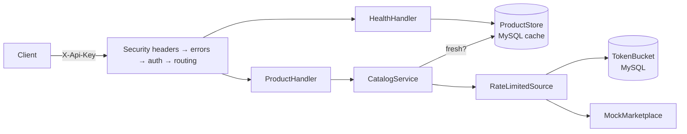

# Amazon-style Catalog API

[](https://github.com/ramanbasu-business/amazon-style-catalog-api/actions/workflows/ci.yml)

A read-through catalog API that serves marketplace product data from a local cache,
calling the marketplace only when the cached copy is missing or stale.

## Objective

A retailer selling on an external marketplace needs that marketplace's product data
inside its own systems: look up a product by the marketplace's identifier or by an
internal SKU, search the catalog by keyword, and read the current price. Going to the
marketplace for every one of those reads is slow and burns a request quota that is
capped per operation.

This service sits in between. It holds a local copy of each product it has seen, serves
reads from that copy while it is fresh, and refreshes from the marketplace when it is
not. Calls toward the marketplace pass through a rate limiter shared by every process,
so the quota is respected no matter how much traffic arrives.

**There is no Amazon integration in this repository, and no marketplace account is
needed to run it.** "Amazon-style" describes the shape of the problem — a throttled,
batch-oriented marketplace API of the kind Amazon's SP-API is — not a client for it. The
only `SourceAdapter` implementation shipped is `MockMarketplace`, which generates
products and throttles on purpose so those paths are exercised. All product data is
invented; no real brand, seller or identifier appears anywhere.

### Out of scope

- Any real marketplace credentials or live integration. `SourceAdapter` is the seam
  where one would go.
- HTML scraping of any kind.
- A user interface. This is an API, exercised with `curl`.
- Multi-tenancy, user accounts and billing. Authentication is one service API key.
- Order and fulfilment flows. Catalog reads only.
- **Batch catalog updates.** Specified in [docs/SPEC.md](docs/SPEC.md) and the database
  schema has tables for it, but no code implements it yet. See Known limits.

## Architecture

A small layered design: HTTP handlers, a service layer holding the cache policy, and
two interfaces — `ProductStore` for storage and `SourceAdapter` for the marketplace.
Clean Architecture would be more structure than ~1,400 lines of code can justify, so
there are three namespaces, not four projects. Both interfaces exist because each one
is a real substitution point the tests use, not for symmetry.



| Component            | Responsibility                                                       |
| -------------------- | -------------------------------------------------------------------- |
| `Http\Handler`       | Input validation, status codes, JSON shape. No business rules.        |
| `Catalog\CatalogService` | The cache policy: when to trust the local copy, when to refresh.  |
| `Catalog\ProductStore`   | Storage interface. `MysqlProductRepository` is the implementation. |
| `Source\SourceAdapter`   | Marketplace interface. `MockMarketplace` is the implementation.    |
| `Source\RateLimitedSource` | Decorator spending a token before every source call.             |
| `RateLimit\TokenBucket`  | Per-operation bucket in the database, shared across processes.     |
| `Support`            | Config, clock, database connection.                                   |

Three decisions worth knowing before reading the code:

**A stale product beats an error.** If the source fails while refreshing something
already cached, `CatalogService` returns the stale copy and logs the failure. A caller
reading a price would rather have a 15-minute-old number than a 503.

**The rate limiter lives in the database, not in memory.** The API and a future worker
are separate containers sharing one quota at the source. Two in-memory buckets would
together spend twice the allowance. The row is claimed with `FOR UPDATE` so two
processes cannot both spend the last token.

**A refused call never leaves the process.** When the local bucket is empty the request
is rejected here, so the real quota is not spent on a call the source would throttle.

## Coding style

- **PHP 8.3** (CI also runs 8.4), `declare(strict_types=1)` in every file.
- **PSR-12** enforced by `phpcs`; 120-character lines. Tests are named
  `Method_Scenario_ExpectedResult`, which needs PSR-1's camelCase sniff lifted for
  `tests/` only — commented in `phpcs.xml`.
- **PHPStan level 8**, no baseline and no suppressions. Where level 8 flagged something,
  the cause was fixed: `@phpstan-impure` on `reserve()` is a true statement about a
  method that mutates stored state, not a silencer.
- **Constructor injection everywhere**, no static state, no service location inside
  classes. Everything is wired in one readable file, `src/App/Kernel.php`.
- **Time is injected** through the `Clock` interface, so cache staleness and token
  refill are tested without sleeping.
- **Errors**: one handler renders every throwable as an RFC 9457 problem document. Only
  `ApiProblem` carries a message to the client; anything else is logged and returned as
  a bare 500, so a stack trace cannot escape even if `APP_DEBUG` is wrong.
- **Commits** follow Conventional Commits, one logical change each, merged by pull
  request.

## Run it in 2 minutes

```bash
cp .env.example .env     # placeholders only; edit API_KEY and DB_PASSWORD
docker compose up        # starts MySQL, applies migrations, serves on :8080
```

Then, using the `API_KEY` you set:

```bash
# Health needs no key
curl localhost:8080/health

# Search; results are cached as a side effect
curl -H "X-Api-Key: $API_KEY" "localhost:8080/v1/products?q=kettle&limit=3"

# Look one up by the marketplace id returned above
curl -H "X-Api-Key: $API_KEY" localhost:8080/v1/products/MP1A2B3C4D

# Missing key is rejected
curl -i localhost:8080/v1/products/MP1A2B3C4D
```

Tests:

```bash
composer test:unit         # no database needed
composer test:integration  # needs MySQL; DB_HOST must be set
composer lint              # PSR-12
composer analyse           # PHPStan level 8
```

The integration suite skips itself when `DB_HOST` is unset, so the unit suite runs on a
clean checkout with nothing installed. CI always provides a database, so CI always runs
both.

## Configuration

Every value comes from the environment. A missing required value fails at startup with
the key name and never the value.

| Variable | Purpose | Example |
| --- | --- | --- |
| `APP_ENV` | Log channel name | `local` |
| `APP_DEBUG` | Verbose Slim errors; never `true` in production | `false` |
| `DB_HOST` | MySQL host; compose service name | `db` |
| `DB_PORT` | MySQL port | `3306` |
| `DB_NAME` | Database name | `catalog` |
| `DB_USER` | Database user | `catalog` |
| `DB_PASSWORD` | Database password | `CHANGE_ME` |
| `API_KEY` | The single service key callers send as `X-Api-Key` | `CHANGE_ME` |
| `PRODUCT_CACHE_TTL_SECONDS` | How long a cached product stays fresh | `900` |
| `SOURCE_RATE_BURST` | Token bucket size per source operation | `10` |
| `SOURCE_RATE_REFILL_PER_SECOND` | Token refill rate | `2` |
| `MOCK_THROTTLE_RATE` | Share of mock calls that throttle, 0–1 | `0.15` |
| `MOCK_ROW_REJECT_RATE` | Share of mock batch rows rejected, 0–1 | `0.10` |
| `MOCK_JOB_COMPLETE_AFTER_SECONDS` | Mock batch completion delay | `5` |

Generate a key with `openssl rand -hex 32`.

## Security and compliance notes

What the code does:

- **Parameterised queries only.** No request value is concatenated into SQL. `LIKE`
  wildcards in a search keyword are escaped, so a caller cannot widen a search to a full
  table scan with `%`.
- **Input validated at the edge.** Identifiers are matched against a character
  allowlist and pagination against integer bounds before any lookup happens; failures
  return 422 with per-field messages.
- **Secrets from the environment only.** `.env` is git-ignored; `.env.example` holds
  placeholders. Startup fails on a missing required value and prints the key, not the
  value.
- **Constant-time key comparison** with `hash_equals`, so the key cannot be recovered by
  timing failed requests.
- **Security headers** on every response, error responses included: `nosniff`,
  `X-Frame-Options: DENY`, `Referrer-Policy: no-referrer`, a `default-src 'none'` CSP
  and `Cache-Control: no-store`.
- **Rate limiting** toward the source, shared across processes.
- **Structured JSON logs** carrying identifiers and failure reasons only — no request
  bodies, no credentials.
- **No stack traces to clients.** Unrecognised throwables become a bare 500.
- **Container runs as a non-root user.**
- **CI scanning**: Semgrep (`p/php`, `p/security-audit`, `p/secrets`), gitleaks over the
  full history, and `composer audit` against the lock file. All three fail the build.

On data protection: this service stores product catalog data, not personal data, so the
GDPR questions of export, erasure and retention do not arise here. Saying it is "aligned
with GDPR principles" would be claiming something the code does not do. The logging rule
above — identifiers only, never payloads — is the habit that matters if personal data is
ever added.

Report a vulnerability as described in [SECURITY.md](SECURITY.md).

## Design decisions

- [ADR 0001](docs/adr/0001-php-instead-of-dotnet.md) — PHP 8.3 and Slim rather than .NET 8
- [ADR 0002](docs/adr/0002-mysql.md) — MySQL 8 rather than PostgreSQL
- [ADR 0003](docs/adr/0003-database-job-queue.md) — job queue in the database rather than Redis
- [ADR 0004](docs/adr/0004-single-api-key.md) — one service API key rather than JWT
- [ADR 0005](docs/adr/0005-semgrep-instead-of-codeql.md) — Semgrep and gitleaks rather than CodeQL

## Known limits and next steps

Stated plainly, because a reviewer will find these anyway:

1. **Batch catalog updates are not implemented.** [docs/SPEC.md](docs/SPEC.md) specifies
   submission, idempotency keys, polling and per-row results, and `001_init.sql` creates
   the `jobs` and `job_rows` tables. No code reads or writes them, and there is no
   worker. ADR 0003 describes the queue design that would go there. This is the largest
   gap between the spec and the code.
2. **No OpenAPI document.** The endpoints are described in this README and in the
   handler tests, not in a machine-readable spec.
3. **One `/health` endpoint**, not the `/health/live` and `/health/ready` split an
   orchestrator would want.
4. **No correlation ID** threaded through logs, so concurrent requests interleave.
5. **The container serves with PHP's built-in web server**, which handles one request at
   a time. Fine for a demonstration, wrong for production — that would be PHP-FPM behind
   nginx.
6. **Search always calls the source** when it is reachable; only individual products are
   served from cache. Caching result sets would need a keyword-level freshness rule that
   does not exist yet.
7. **No architecture test** enforces the layering; it is held by review and by the small
   number of namespaces.
8. **The rate limiter adds a database round trip** to every source call. At this scale
   that is cheaper than being throttled, but it would not hold at high throughput.

## AI assistance, license, author

Built with AI assistance (Claude). Architecture, review and testing by Raman Basu.

Licensed under the [MIT License](LICENSE).

Author: Raman Basu — [github.com/ramanbasu-business](https://github.com/ramanbasu-business)
