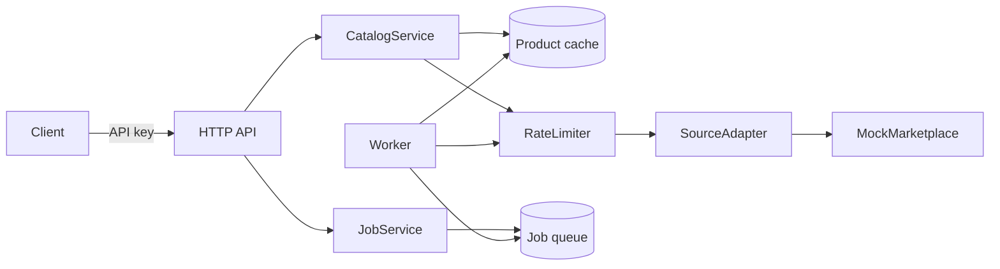

# Catalog API — Specification

Status: draft, awaiting Raman's confirmation. No code written yet.

## One sentence

A read-through catalog API that looks up and caches product data from a pluggable
marketplace source, and tracks the status of catalog update jobs submitted back to it.

## Naming

Working repo name: `catalog-api`. Raman's original title was "Amazon Scrapper Api -
catalog". Two changes proposed, both reversible:

- "Scrapper" is a misspelling of "Scraper".
- Nothing in this project scrapes HTML. It calls a marketplace's product API through an
  adapter interface, and the only adapter shipped is a mock one. Calling it a scraper
  would describe work the code does not do, and signals terms-of-service risk to a
  client reviewing the repo.

## The problem

A retailer selling on an external marketplace needs product data from that marketplace
inside its own systems: match an internal SKU to the marketplace's catalog identifier,
read the current competitive price, and push price and inventory changes back.

The marketplace API makes this awkward:

- **Throttled.** Requests are rate-limited per operation, with quotas that refill over
  time. Naive loops get rejected.
- **Asynchronous writes.** Updates are submitted as batch jobs. The response is a job
  id, not a result. The outcome must be polled, and can be partial — 900 of 1000 rows
  accepted, 100 rejected with per-row errors.
- **Expensive reads.** The same product gets looked up repeatedly by different parts of
  the business. Uncached, this burns the request quota.

This project is the service that sits between the two and absorbs that awkwardness.

## Scope

In scope:

1. **Product search and lookup.** Search the catalog by keyword, and fetch a single
   product by its catalog identifier or by an internal SKU. Results are normalised into
   the project's own product shape, not passed through raw.
2. **Read-through cache.** Lookups are served from the local store when fresh, and from
   the source when stale or missing. TTL is configurable per operation.
3. **Rate limiting toward the source.** A token-bucket limiter per operation, so the
   service stays inside quota regardless of incoming load. Requests that cannot proceed
   queue rather than fail.
4. **Catalog update jobs.** Submit a batch of price or inventory changes, get a job id
   back, poll for status, and read a per-row result report once the job completes.
5. **Retries with backoff.** Transient source failures (throttling, 5xx, timeouts) are
   retried with exponential backoff and jitter. Permanent failures (validation, auth)
   are not.
6. **Idempotency.** A submission carries a client-supplied idempotency key. Replaying
   the same key returns the original job instead of creating a second one.
7. **Mock marketplace adapter.** A local adapter that behaves like a real marketplace:
   throttles, delays job completion, and rejects a configurable share of rows. This is
   what the test suite and `docker compose up` run against.

Out of scope, and stated in the README as such:

- Any real marketplace credentials or live integration. The adapter interface is the
  seam where one would go; no live adapter is implemented.
- HTML scraping of any kind.
- A user interface. This is an API, exercised via OpenAPI docs and `curl`.
- Multi-tenancy, billing, and user accounts. Authentication is a single service API key.
- Order and fulfilment flows. Catalog data only.

## Main components

| Component        | Responsibility                                                          |
| ---------------- | ----------------------------------------------------------------------- |
| `HTTP API`       | Routing, auth, input validation, JSON responses, problem-detail errors. |
| `CatalogService` | Read-through lookup: cache check, staleness rule, source fetch.          |
| `JobService`     | Accepts submissions, enforces idempotency, exposes job status.           |
| `RateLimiter`    | Token bucket per source operation, backed by the datastore.              |
| `SourceAdapter`  | Interface for a product-data source. One implementation: the mock.       |
| `Worker`         | CLI long-running process: drains the job queue, polls job results.       |

## Endpoints (first pass)

| Method | Path                      | Purpose                                  |
| ------ | ------------------------- | ---------------------------------------- |
| GET    | `/health`                 | Liveness and datastore check.            |
| GET    | `/v1/products`            | Keyword search, paginated.               |
| GET    | `/v1/products/{id}`       | Lookup by catalog id.                    |
| GET    | `/v1/products/sku/{sku}`  | Lookup by internal SKU.                  |
| POST   | `/v1/jobs/price`          | Submit price changes. Returns job id.    |
| POST   | `/v1/jobs/inventory`      | Submit inventory changes.                |
| GET    | `/v1/jobs/{id}`           | Job status.                              |
| GET    | `/v1/jobs/{id}/report`    | Per-row results once complete.           |

## Stack

PHP 8.3, Slim 4, Doctrine DBAL, MySQL 8, PHPUnit, Docker Compose, GitHub Actions.

The showcase default is .NET 8; Raman chose PHP. Recorded as ADR-0001 with the reason,
so a reviewer sees it was a decision rather than an accident. Slim rather than Laravel
because the project is a small API with no need for an ORM, templating or auth stack,
and a thin framework leaves the design decisions visible in the repo's own code.

Local PHP is 8.4.23 and Composer 2.10.2; CI will test 8.3 and 8.4.

## Testing

- Unit tests: staleness rule, token bucket refill, backoff schedule, idempotency key
  handling, row validation.
- Integration tests: each endpoint against a real PostgreSQL in a container and the mock
  adapter — including a throttled source, a partially rejected job, and a replayed
  idempotency key.

## Security baseline

Prepared statements throughout, validation on every input, API key and database
credentials from the environment, no personal data in logs, security headers, rate
limiting on public endpoints, structured JSON logs. Each item noted in `SECURITY.md`.

## Not from the old project

The `Webstore/amazon` folder is client work (real merchant identifiers, a bundled
vendor SDK, a retired API). It is the source of the *problem description* above and
nothing else. No file, name, schema or code fragment is carried across. All data in this
repo is generated.

## Decisions made

Settled by Raman, each with an ADR:

1. **MySQL 8**, not PostgreSQL (ADR-0002).
2. **Job queue in the database**, no Redis (ADR-0003). `SELECT ... FOR UPDATE SKIP
   LOCKED` gives safe multi-worker claiming on MySQL 8 without another moving part.
3. **A single service API key**, no JWT (ADR-0004). The service has one caller type and
   no end users; a token issuer would be scope the project does not need.
